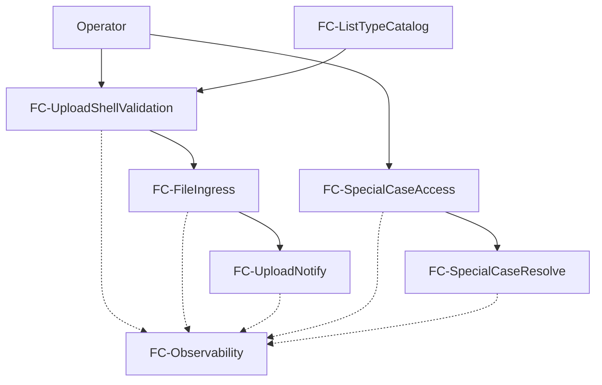
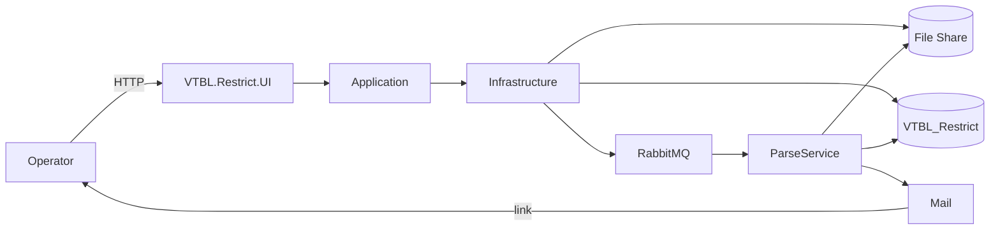

# Архитектура: VTBL.Restrict.UI

**Дата:** 15.07.2026  
**Статус:** утверждена (этап Архитектуры); versioned-копия в git (15.07.2026)  
**ТЗ:** `docs/implementation/technical_specification.md` (EC-01…EC-08 приняты; пайплайн-артефакт локально)  
**Контекст:** каркас `VTBL.Restrict.UI` (net5.0 Razor Pages); DDL/модель — `docs/db/`; интеграция — `docs/integration-file-rmq.md`

---

## 1. Описание задачи

Реализовать веб-UI оператора для:

1. Загрузки файла рестриктивного списка **as is** на удалённую папку и уведомления парсера через RabbitMQ (UC-01, UC-02, UC-05).
2. Обработки особого случая по deep-link из письма с чтением/записью только через БД (UC-03, UC-04).

UI не парсит Excel/CSV, не вызывает HTTP API парсера. Парсер и почта — внешние системы.

**Покрытие UC:**

| UC | Компоненты |
| --- | --- |
| UC-01 | Upload UI → UploadApplication → FileShare + UploadBatchRepo + RmqPublisher |
| UC-02 | Error mapping / logging в UI + Application |
| UC-03 / UC-04 | SpecialCase UI → SpecialCaseApplication → SpecialCaseRepo (только БД) |
| UC-05 | ListTypeRepo (чтение IsActive) без смены сценария Upload |

---

## 2. Функциональная архитектура

### 2.1. Функциональные компоненты

#### FC-UploadShellValidation

**Назначение:** проверки оболочки файла до любых side-effects.

**Функции:**
- ValidateUploadMeta: тип списка активен; расширение в whitelist; размер ≤ MaxFileSizeBytes; поток не пустой.
  - Вход: listTypeCode, fileName, contentLength/stream length, stream
  - Выход: ok / error code
  - UC: UC-01 А1, UC-02
- Запрет: чтение/интерпретация содержимого (EC-01, EC-02).

**Зависимости:** ListType (активность), конфигурация RestrictStorage.

#### FC-FileIngress

**Назначение:** атомарная выкладка потока as is на шару.

**Функции:**
- BuildTargetPath: RemoteRoot + FolderSegment + yyyy/MM/dd + `{correlationId}_{sanitizedName}`
- CopyStreamAsIs: stream → temp → rename (EC-01, EC-08)
- CleanupTempOnFailure
  - UC: UC-01

**Зависимости:** FC-UploadShellValidation (успех); ListType.FolderSegment.

#### FC-UploadNotify

**Назначение:** учёт загрузки и уведомление парсера.

**Функции:**
- CreateUploadBatch (NotifyStatus=Pending) после успешной записи файла
- Publish RestrictFileUploaded в RMQ (только после записи файла — EC-08)
- MarkPublished / MarkFailed
- RetryNotify: publish по StoredFilePath без повторной копии файла (UC-01 А3)
  - UC: UC-01, UC-02

**Зависимости:** FC-FileIngress; SQL UploadBatch; RabbitMQ.

#### FC-SpecialCaseAccess

**Назначение:** авторизация deep-link и загрузка кейса.

**Функции:**
- AuthenticateLink: caseId + raw token → SHA-256 → сравнение с AccessTokenHash; ExpiresAt; Status
- LoadCaseView: SpecialCase + Items (ORDER BY SortOrder) из БД; **не** открывать файл на шаре
  - UC: UC-03, UC-04

**Зависимости:** SQL SpecialCase / SpecialCaseItem.

#### FC-SpecialCaseResolve

**Назначение:** сохранение правок оператора.

**Функции:**
- ValidateRequiredUserValues
- ResolveInTransaction: UPDATE UserValue items + Status=ResolvedByUser + ResolvedAt/ResolvedBy; запрет если не Pending
  - UC: UC-03 А2–А4

**Зависимости:** FC-SpecialCaseAccess; SQL (роль restrict_ui).

#### FC-ListTypeCatalog

**Назначение:** справочник типов для UI загрузки (UC-05).

**Функции:**
- ListActiveTypes → Code, Name, FolderSegment, RoutingKeySuffix

**Зависимости:** SQL ListType.

#### FC-Observability

**Назначение:** логирование с correlationId / caseId / listType; без сырого token и лишнего PII.

**UC:** все.

### 2.2. Диаграмма функциональных компонентов



---

## 3. Системная архитектура

### 3.1. Архитектурный стиль

**Модульный монолит + слоистая структура (Clean/Onion light)** внутри одного deployable ASP.NET Core host.

**Обоснование:** один продукт UI, умеренная нагрузка, жёсткий EC без отдельного HTTP к парсеру; микросервисы избыточны. Слои нужны для запрета протечки парсинга/IO в Pages и тестируемости Application.

### 3.2. Раскладка проектов (целевая)

Сейчас в solution только `VTBL.Restrict.UI` (net5.0). На старте реализации — раскладка:

| Проект | Тип | Назначение |
| --- | --- | --- |
| `VTBL.Restrict.UI` | ASP.NET Core Razor Pages host | Pages, DI composition, auth stub, middleware ошибок |
| `VTBL.Restrict.Application` | classlib | сценарии Upload / RetryNotify / OpenSpecialCase / ResolveSpecialCase; DTO; порты (interfaces) |
| `VTBL.Restrict.Domain` | classlib | сущности/enum: NotifyStatus, SpecialCaseStatus; value rules (sanitize filename, hash token) |
| `VTBL.Restrict.Infrastructure` | classlib | SQL (Dapper), FileShareStore, RabbitMqPublisher, options binding |

**Зависимости:** UI → Application, Infrastructure (только composition); Application → Domain; Infrastructure → Application (ports) + Domain. UI не ссылается на SQL/RMQ напрямую в PageModels, кроме DI.

**Альтернатива отклонена:** оставить всё в одном UI-проекте — допустимо для прототипа, но усложняет соблюдение EC (риск OpenXML и т.п.) и тестирование.

### 3.3. Компоненты системы

#### C-UI Host (`VTBL.Restrict.UI`)

**Тип:** Web host  
**Технологии:** ASP.NET Core Razor Pages  
**Реализует:** отображение Upload / Special Case placeholder / Invalid link; mapping ошибок UC-02  
**Входящие:** HTTP от оператора  
**Исходящие:** Application services  

Страницы (маршруты):
- `/` или `/upload` — загрузка
- POST retry notify (по UploadBatchId / CorrelationId)
- `/special-cases/{caseId}` — кейс + `?token=`
- состояние отказа на том же маршруте или `/special-cases/invalid`

#### C-Application

**Сценарии (application services):**
1. `UploadRestrictFileCommand` — validate → copy as-is → Insert Pending → publish → Published | Failed
2. `RetryUploadNotificationCommand` — см. контракт Retry ниже (без FileIngress)
3. `GetSpecialCaseForOperatorQuery` — auth token → view model
4. `ResolveSpecialCaseCommand` — validate → transaction resolve

**Контракт `RetryUploadNotificationCommand`:**
1. Вход: `correlationId` (с формы retry).
2. Загрузить `UploadBatch` по `CorrelationId`; если не найден — ошибка UI, publish нет.
3. Допустимые статусы для retry: `Failed` или `Pending` (recovery после сбоя UPDATE); если `Published` — ошибка «уже уведомлено», publish нет.
4. Загрузить `ListType` по `ListTypeId` batch.
5. Собрать payload: `correlationId` = batch.CorrelationId; `listType` = ListType.Code; `filePath` = batch.StoredFilePath; `originalFileName` = batch.OriginalFileName; `uploadedAtUtc` = batch.UploadedAt (UTC); `uploadedBy` = batch.UploadedBy; `messageType`/`schemaVersion` — как при первичной отправке.
6. Routing key: `restrict.upload.{ListType.RoutingKeySuffix}`.
7. Publish; при успехе → `NotifyStatus=Published`; при ошибке → оставить/выставить `Failed`, показать ошибку.

Порты:
- `IListTypeReadStore`
- `IFileShareStore` (`WriteStreamAsIsAsync`, путь)
- `IUploadBatchStore`
- `IUploadNotifier` (RMQ publish)
- `ISpecialCaseStore`

#### C-Infrastructure

- `UncFileShareStore`: SMB/UNC via `FileStream` / `File.Move`; temp `.tmp` + rename; cleanup
- `RabbitMqUploadNotifier`: RabbitMQ.Client, exchange topic `restrict.uploads`, routing `restrict.upload.{suffix}`, persistent
- `Sql*Store`: Dapper + `Microsoft.Data.SqlClient`, connection string role `restrict_ui`
- Options: `RestrictStorageOptions`, `RabbitMqOptions`, `ConnectionStrings`

#### C-External (вне границ кода UI)

| Система | Роль |
| --- | --- |
| File share | inbox файлов |
| RabbitMQ | транспорт к парсеру |
| SQL Server `VTBL_Restrict` | данные |
| ParseService | consumer RMQ, пишет SpecialCase, шлёт mail |
| Mail | доставка deep-link оператору |

### 3.4. Диаграмма компонентов



### 3.5. Потоки (инварианты EC)

**Upload (EC-08):**

```text
validate meta
→ write stream as-is to share (success required)
→ INSERT UploadBatch NotifyStatus=Pending
→ publish RMQ
→ UPDATE NotifyStatus Published | Failed
→ UI ack (не ждёт парсер)
```

При ошибке записи на шару: RMQ не вызывать; temp удалить.  

**Orphan после успешного WriteAsIs при сбое INSERT UploadBatch (MVP):** файл на шаре **не** удаляется автоматически; RMQ **не** публикуется; оператору — ошибка инфраструктуры с `correlationId` и путём в логах (не обязательно в UI целиком); зачистка — зона поддержки. Обоснование: silent delete может скрыть единственную копию входного файла.

**Переходы NotifyStatus:**
- `Pending → Published` после успешного publish
- `Pending → Failed` после ошибки publish
- `Failed → Published` только на успешном Retry
- Повторный publish **запрещён**, если статус уже `Published`
- Если publish успешен, а UPDATE в Published падает: статус может остаться `Pending` при уже отправленном сообщении; допустим повторный publish (парсер идемпотентен по `correlationId`); UI при retry для Pending тоже разрешён как recovery (см. Retry-контракт)

При ошибке RMQ после INSERT: файл и batch остаются; `Failed` + Retry.

**Special Case (EC-05):**

```text
GET caseId+token → hash → load DB only → edit → transactional resolve
```

Запрет: `File.Open(SourceFilePath)` / чтение листа.

---

## 4. Модель данных

Каноническая физическая модель и DDL — **`docs/db/`** (01–05). Архитектура UI **не дублирует проектирование DDL**; фиксирует использование и границы владения.

### 4.1. Концептуальная модель

##### ListType
Справочник типов списков (MVK, TERRORISTS, …).  
Атрибуты: ListTypeId, Code, Name, FolderSegment, RoutingKeySuffix, IsActive, CreatedAt.  
Правила: UI показывает только IsActive=1; Code стабилен для RMQ `listType`.

##### UploadBatch
Факт выкладки UI.  
Атрибуты: UploadBatchId, CorrelationId (UK), ListTypeId, OriginalFileName, StoredFilePath, UploadedBy, UploadedAt, NotifyStatus ∈ {Pending, Published, Failed}.  
Правила: создаётся UI после успешной записи файла; retry меняет только NotifyStatus и повторно публикует.

##### SpecialCase
Кейс ручной обработки.  
Атрибуты: SpecialCaseId, ListTypeId, UploadCorrelationId?, AccessTokenHash (SHA-256), Status ∈ {Pending, ResolvedByUser, Expired, Cancelled}, ExpiresAt, SourceFilePath? (текст), audit fields.  
Правила: UI не INSERT; resolve только Pending + not expired; token в БД только hash.

##### SpecialCaseItem
Проблемные поля.  
Атрибуты: SpecialCaseItemId, SpecialCaseId, FieldCode, RowNumber?, RawValue?, ParserMessage?, UserValue?, IsRequired, SortOrder.  
Правила: UI обновляет только UserValue; при IsRequired UserValue обязателен на resolve.

**Связи:** ListType 1—N UploadBatch; ListType 1—N SpecialCase; SpecialCase 1—N SpecialCaseItem.

### 4.2. Логическая модель (сводка для UI)

Схема `restrict`, БД `VTBL_Restrict`. Типы/индексы — как в `docs/db/03-physical.md` и `docs/db/05-ddl.sql`.

Ключевые индексы для UI:
- `UX_ListType_Code`; фильтр `IsActive`
- `UX_UploadBatch_CorrelationId`; lookup для retry
- PK `SpecialCaseId` + items `IX_SpecialCaseItem_SpecialCaseId (SpecialCaseId, SortOrder)`

### 4.3. Диаграмма

```text
┌─────────────┐       ┌──────────────┐
│  ListType   │──1:N──│ UploadBatch  │
└──────┬──────┘       └──────────────┘
       │
       │1:N
       ▼
┌──────────────┐ 1:N ┌──────────────────┐
│ SpecialCase  │─────│ SpecialCaseItem  │
└──────────────┘     └──────────────────┘
```

### 4.4. Миграции и версионирование

- Исходный скрипт: `docs/db/05-ddl.sql` (+ seed MVK/TERRORISTS).
- Применение на стендах: ручной DBA / sqlcmd на MVP; при необходимости позже — DbUp/FluentMigrator (не блокер).
- Изменения схемы после MVP — версионируемые скрипты в `docs/db/migrations/` (появится при необходимости).
- UI использует роль `restrict_ui` (`docs/db/04-access.md`): нет CREATE SpecialCase; нет UPDATE AccessTokenHash/RawValue/ParserMessage.

### 4.5. Доступ UI к данным (операции)

| Операция | SQL-суть |
| --- | --- |
| Active list types | `SELECT … WHERE IsActive=1` |
| Insert batch | `INSERT UploadBatch … Pending` |
| Update notify | `UPDATE NotifyStatus` |
| Get batch by CorrelationId | для Retry |
| Get case + items | JOIN / 2 queries by SpecialCaseId |
| Resolve | transaction: UPDATE items UserValue; UPDATE case Status/Resolved* WHERE Status=Pending AND ExpiresAt>UtcNow |

---

## 5. Интерфейсы

### 5.1. Внешние (HTTP UI — не REST API парсера)

UI — server-rendered Razor Pages (+ form POST). Отдельного публичного JSON API парсера нет (EC-03).

| Маршрут | Метод | Назначение | UC |
| --- | --- | --- | --- |
| `/upload` (или `/`) | GET | форма: ListType + DnD/file + Отправить | UC-01 |
| `/upload` | POST multipart | upload command | UC-01 |
| `/upload/retry` | POST | retry notify по CorrelationId | UC-01 А3 |
| `/special-cases/{caseId}?token=` | GET | форма кейса / отказ / read-only | UC-03/04 |
| `/special-cases/{caseId}?token=` | POST | resolve | UC-03 |

Ошибки: HTTP 200 с моделью ошибки UI или 400 на валидации; без stack trace в body (UC-02).

### 5.2. Внутренние порты Application

##### IFileShareStore
- `Task<string> WriteAsIsAsync(Stream content, string targetFullPath, CancellationToken ct)`  
  Реализация: temp рядом + rename; при сбое — удалить temp; **не** читать содержимое для бизнес-логики.

##### IUploadNotifier
- `Task PublishUploadedAsync(RestrictFileUploadedMessage msg, string routingKey, CancellationToken ct)`

##### IUploadBatchStore / ISpecialCaseStore / IListTypeReadStore
- CRUD по границам §4.5

### 5.3. Интеграция RabbitMQ (UI → Parser)

**Топология (конфиг, черновик имён — A-07):**
- Exchange: `restrict.uploads` (topic, durable)
- Routing key: `restrict.upload.{RoutingKeySuffix}`
- Persistent: true
- UI только publish; consumer — парсер

**Payload:**

```json
{
  "messageType": "RestrictFileUploaded",
  "schemaVersion": 1,
  "correlationId": "uuid",
  "listType": "MVK",
  "filePath": "\\\\server\\share\\...\\corr_name.xlsx",
  "originalFileName": "name.xlsx",
  "uploadedAtUtc": "ISO-8601",
  "uploadedBy": "domain\\user-or-null"
}
```

Обязательные: correlationId, listType, filePath, uploadedAtUtc.

**Ошибки:** исключение publish → MarkFailed; UI предлагает Retry (без FileIngress).

### 5.4. Интеграция File Share

- RemoteRoot из конфига
- Путь: `{RemoteRoot}\{FolderSegment}\{yyyy}\{MM}\{dd}\{correlationId}_{sanitizedOriginalName}`
- Санитизация: запрет `..`, `\`, `/` в original name
- Атомарность: `*.uploading` / `.tmp` → rename
- Учётка процесса UI (или explicit credentials) с write на inbox

### 5.5. Интеграция БД

- Connection string на `VTBL_Restrict`, схема `restrict`
- Роль приложения: `restrict_ui`
- Special Case: только БД; SourceFilePath — display string

### 5.6. Запрещённые интеграции

- HTTP client к парсеру
- OpenXML / CsvHelper / чтение листов в UI solution (запрет зависимостей в Architecture review gate)

---

## 6. Стек технологий

### 6.1. Backend / Host

| Выбор | Решение |
| --- | --- |
| Язык | C# |
| Host | ASP.NET Core Razor Pages |
| TFM сейчас | net5.0 (каркас) |
| **Рекомендация prod** | **миграровать на net8.0 LTS до prod** |

**Обоснование net8:** net5 EOS; поддержка безопасности/пакетов; LTS. MVP-разработку допустимо начать на net5 с первым техническим эпиком «retarget net8», либо сразу поднять solution на net8 при раскладке проектов (предпочтительно).

### 6.2. Frontend

Razor Pages + минимальный JS для DnD (без SPA). Визуал Special Case — placeholder (EC-07).

### 6.3. Данные и интеграции

| Слой | Выбор | Обоснование |
| --- | --- | --- |
| SQL | SQL Server + Dapper | DDL готов; простой SQL под известные запросы; EF избыточен |
| RMQ | RabbitMQ.Client | один publish; MassTransit тяжелее без нужды |
| Файлы | System.IO UNC/SMB | as-is stream copy |
| Логи | ILogger + correlation scope | NFR наблюдаемость |

### 6.4. Существующее → новое

| Уже есть | Добавляется |
| --- | --- |
| `VTBL.Restrict.UI` net5 каркас | Application/Domain/Infrastructure projects |
| — | пакеты: Dapper, SqlClient, RabbitMQ.Client |
| docs/db DDL | применение на стендах |

---

## 7. Безопасность

### 7.1. Аутентификация

- **Special Case:** первичный фактор — высокоэнтропийный token в query; хранение SHA-256; TTL ExpiresAt (A-01).
- **Upload (MVP):** заглушка/опциональный Windows Authentication или конфиг-пользователь (A-01); prod auth (`deferred-ops`) не блокирует архитектуру: точка расширения — ASP.NET Core Authentication middleware без смены Application ports.

### 7.2. Авторизация данных

- Матрица `docs/db/04-access.md`
- UI не создаёт SpecialCase; не меняет hash/raw parser fields

### 7.3. Защита

- Параметризованный SQL (Dapper)
- Antiforgery на POST форм
- XSS: Razor encoding; UserValue как текст
- Не логировать raw token
- Секреты: User Secrets / env / vault; не в git
- Лимит размера upload (RequestSizeLimit + MaxFileSizeBytes)
- CSRF + SameSite cookies при forms auth (когда появится)

---

## 8. Масштабируемость и производительность

- Нагрузка MVP: единичные загрузки операторами; вертикального масштаба host достаточно
- Горизонтально: stateless UI (файлы на общей шаре; state в SQL/RMQ)
- Стриминг upload без буферизации всего файла в MemoryStream при возможности
- ListType: короткий список — без кеша или memory cache с TTL (опционально)
- Не ждать парсер на request path

---

## 9. Надёжность и отказоустойчивость

| Сбой | Поведение |
| --- | --- |
| Валидация | ошибка UI; нет файла/RMQ/batch |
| Шара | ошибка; cleanup temp; нет RMQ |
| SQL INSERT batch после успешной записи файла | orphan-файл остаётся; нет RMQ; лог + ошибка оператору (см. §3.5) |
| RMQ после INSERT | Failed + Retry notify |
| БД при resolve | rollback; Status остаётся Pending |
| Шара/RMQ down (UC-02 А1) | на MVP отдельный health-probe при GET `/upload` **не** делается; недоступность проявляется на Submit; баннер «Сервис временно недоступен» — при известных IO/RMQ исключениях на POST |

Логирование: upload, publish, retry, open, save с correlationId/caseId/listType.

Резервное копирование: зона ops (SQL + file share) — вне UI deploy; упомянуть в runbook.

---

## 10. Развёртывание

### 10.1. Окружения

| Env | RemoteRoot / RMQ / SQL | Примечание |
| --- | --- | --- |
| Dev | локальный/тестовый UNC или mock store для unit; real share для integration | |
| Test/Stage | стендовые имена (deferred-ops) | |
| Prod | prod UNC, RMQ vhost, SQL | auth AD/SSO — deferred-ops |

### 10.2. CI/CD (рекомендация)

1. Restore + build solution  
2. Unit (Application + Domain)  
3. Integration (Testcontainers/SQL + RMQ mock) по мере появления  
4. Publish UI  
5. Применить DDL на стенд (ручной gate на MVP)

### 10.3. Конфигурация (пример ключей)

```json
{
  "ConnectionStrings": {
    "RestrictDb": "..."
  },
  "RestrictStorage": {
    "RemoteRoot": "\\\\fileserver\\restrict\\inbox",
    "AllowedExtensions": [ ".xlsx", ".xls", ".csv" ],
    "MaxFileSizeBytes": 52428800
  },
  "RabbitMq": {
    "Host": "rmq-host",
    "VirtualHost": "/",
    "Exchange": "restrict.uploads",
    "Username": "***",
    "Password": "***"
  }
}
```

### 10.4. Порядок внедрения

1. Retarget / создать projects на **net8.0** (рекомендуется сразу) или net5 → net8 отдельной задачей до prod.  
2. Применить `docs/db/05-ddl.sql` на dev.  
3. Infrastructure adapters + DI.  
4. Upload page + UC-01/02.  
5. Special Case pages + UC-03/04.  
6. Seed ListType / UC-05 проверка.

### 10.5. Миграция net5 → net8

**Решение архитектуры:** целевой TFM решения — **net8.0**. Каркас net5 не сохранять как prod baseline.

**Обоснование:** EOS net5; LTS net8; совместимость пакетов SqlClient/RabbitMQ.Client; снижение security debt.

**Шаги:** создать classlib net8; перенести UI на `Microsoft.NET.Sdk.Web` net8; заменить устаревший `Startup` pattern на minimal hosting при касании Program; прогнать smoke upload/special-case на stage.

---

## 11. Execution contract — трассировка

| EC | Как обеспечено в архитектуре |
| --- | --- |
| EC-01/02 | FC-UploadShellValidation + FileShare stream copy; запрет парсеров содержимого |
| EC-03 | нет HTTP клиента парсера; только RMQ publish |
| EC-04 | UncFileShareStore + RabbitMqUploadNotifier |
| EC-05 | SpecialCase только через ISpecialCaseStore/SQL |
| EC-06 | ListType справочник + seed MVK/TERRORISTS |
| EC-07 | placeholder Razor layout без отдельного UX-проекта |
| EC-08 | порядок в UploadRestrictFileCommand; publish только после WriteAsIs success |

---

## 12. Открытые вопросы

Блокирующих вопросов **нет**.

`deferred-ops` (из ТЗ, не блокируют планирование кода):
1. Prod auth оператора (AD/SSO/forms).
2. Точные UNC/учётки по стендам.
3. Финальные имена RMQ exchange/queue/vhost.
4. Префикс routing key по стенду.
5. DLQ на стороне парсера.

Архитектурные допущения — см. `architect_result.json`.
