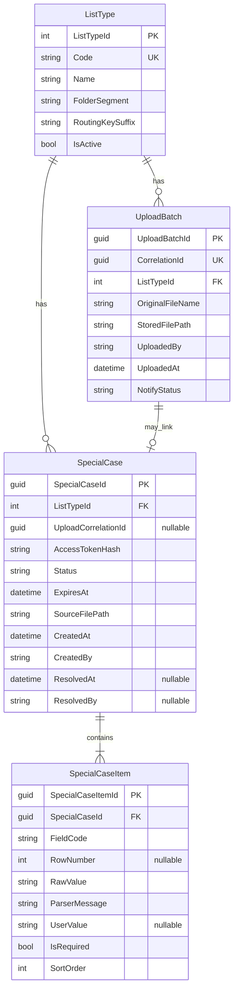

# БД Restrict: логическая ER-модель

**Дата:** 14.07.2026  
**Предшественник:** [01-domain.md](01-domain.md)

## Диаграмма

## Кардинальности

| Связь | Кардинальность | Комментарий |
| --- | --- | --- |
| ListType → UploadBatch | 1:N | Много загрузок одного типа |
| ListType → SpecialCase | 1:N | |
| UploadBatch → SpecialCase | 0..1 : 0..N | Связь мягкая по `UploadCorrelationId` (не жёсткий FK на MVP допустим) |
| SpecialCase → SpecialCaseItem | 1:N | Хотя бы 1 item при создании кейса |

## Примечание по FK UploadBatch ↔ SpecialCase

На MVP связываем логически через `UploadCorrelationId = UploadBatch.CorrelationId` **без обязательного FK**, чтобы парсер мог создать кейс даже если UI не писал `UploadBatch` или correlation потерян. Усиление до FK — после стабилизации контура.
