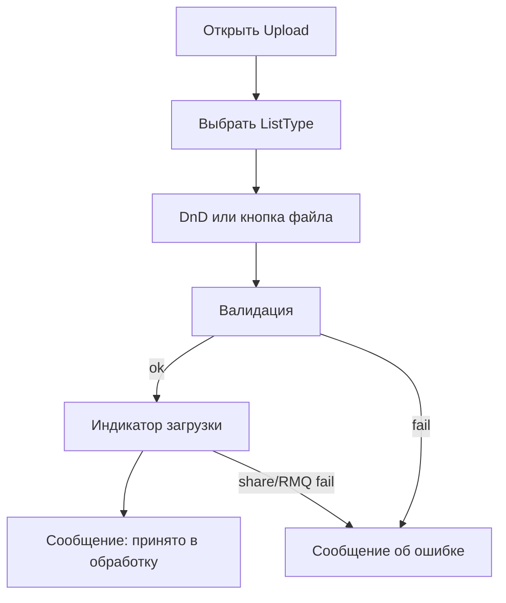

# Поток экранов VTBL.Restrict.UI

**Дата:** 15.07.2026  
**Error Processing UI:** usable Razor (список + кейс); security deferred (без token/TTL gate).

## 1. Карта экранов

| Экран | Маршрут | UC |
| --- | --- | --- |
| Загрузка списка | `/` или `/upload` | UC-01, UC-02 |
| Список обработки ошибок | `/error-processing` | UC-EP-01 |
| Обработка ошибок (кейс) | `/error-processing/{caseId}` (`?token=` опционален, не валидируется) | UC-03 |
| Отказ по ссылке | тот же маршрут кейса → состояние error | UC-04 |
| Privacy/служебные | шаблонные | — |

## 2. Upload

**Элементы:**
- Dropdown/radio типов из `ListType` (`IsActive`).
- Zona DnD + кнопка «Выбрать файл».
- Отображение имени выбранного файла, размера.
- Кнопка «Отправить».
- Блок результата / ошибки.

## 3. Error Processing — список (`/error-processing`)

1. Заголовок «Обработка ошибок».
2. Таблица Pending-кейсов: тип списка, статус, дата создания, путь файла (если есть).
3. Сортировка: новые сверху (`CreatedAt DESC`).
4. Ссылка на кейс → `/error-processing/{caseId}`.
5. Empty state: «Нет кейсов…» при отсутствии Pending.
6. Ошибка БД: сообщение без stack trace.

## 4. Error Processing — кейс (`/error-processing/{caseId}`)

1. Заголовок: тип списка + статус кейса.
2. Мета: `CreatedAt`, `UploadCorrelationId` (если есть), путь файла, `ExpiresAt` (информативно).
3. Таблица/форма по `ErrorProcessingItem` (порядок `SortOrder`):
   - FieldCode / подпись
   - RowNumber (если есть)
   - RawValue (read-only)
   - ParserMessage (read-only)
   - UserValue (input)
4. Кнопка «Сохранить» (только Pending).
5. Состояния: success / read-only (Resolved) / not found / unavailable / db error.
6. Ссылка «К списку» → `/error-processing`.

## 5. Invalid link

Отдельное состояние той же страницы или `/error-processing/invalid`:

- «Ссылка недействительна или устарела»
- Без деталей БД

## 6. Навигация

Navbar:
- **Загрузка** → `/upload`
- **Обработка ошибок** → `/error-processing`

Deep-link из письма на кейс сохраняется; список доступен из navbar (без auth).
