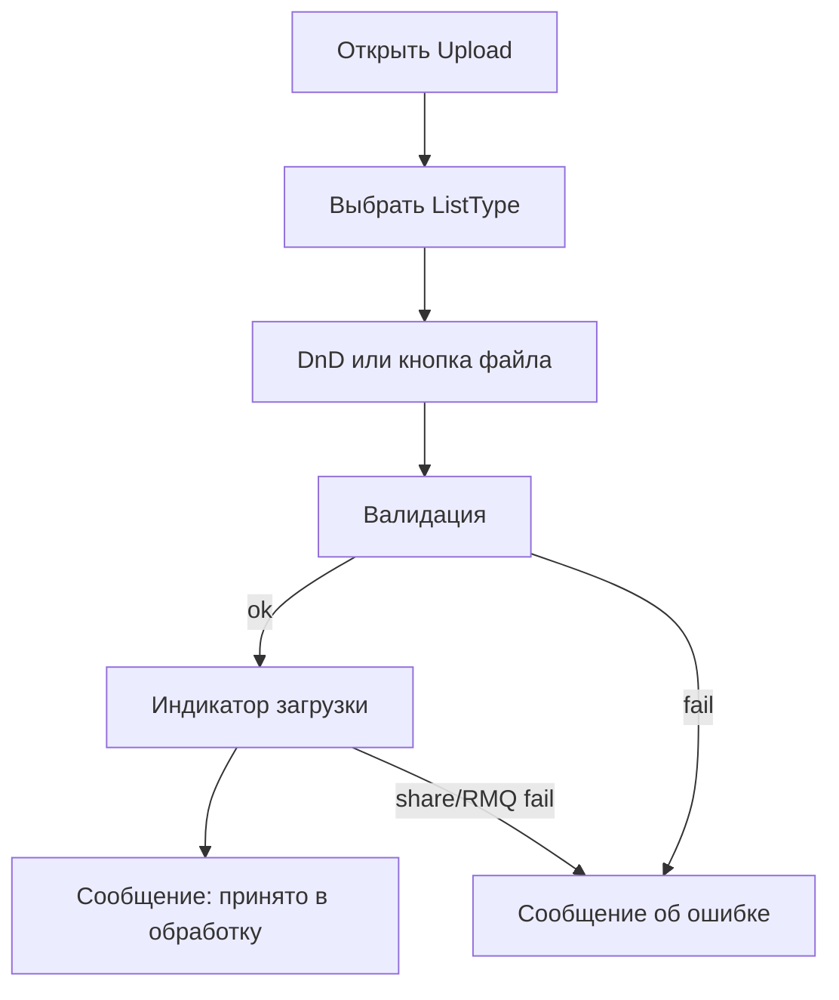

# Поток экранов VTBL.Restrict.UI

**Дата:** 14.07.2026  
**Визуал обработки ошибок** — placeholder; детальный UI обсуждается отдельно.

## 1. Карта экранов

| Экран | Маршрут (черновик) | UC |
| --- | --- | --- |
| Загрузка списка | `/` или `/upload` | UC-01, UC-02 |
| Обработка ошибок | `/error-processing/{caseId}` (`?token=` опционален, не валидируется) | UC-03 |
| Отказ по ссылке | тот же маршрут → состояние error | UC-04 |
| Privacy/служебные | шаблонные | — |

## 2. Upload

**Элементы:**
- Dropdown/radio типов из `ListType` (`IsActive`).
- Zona DnD + кнопка «Выбрать файл».
- Отображение имени выбранного файла, размера.
- Кнопка «Отправить» (или автостарт после выбора — уточнить при UX; **дефолт плана:** явная кнопка «Отправить»).
- Блок результата / ошибки.

## 3. Error Processing (placeholder layout)

Без финального дизайна — информационная структура:

1. Заголовок: тип списка + статус кейса.
2. Мета: имя/путь файла (если есть), срок действия ссылки.
3. Таблица/форма по `ErrorProcessingItem` (порядок `SortOrder`):
   - FieldCode / подпись
   - RawValue (read-only)
   - ParserMessage (read-only)
   - UserValue (input)
4. Кнопка «Сохранить».
5. Состояние success / already resolved / error.

## 4. Invalid link

Отдельное состояние той же страницы или `/error-processing/invalid`:

- «Ссылка недействительна или устарела»
- Без деталей БД

## 5. Навигация

На MVP достаточно Upload в меню; Error Processing открывается только из письма (можно не светить в navbar).
